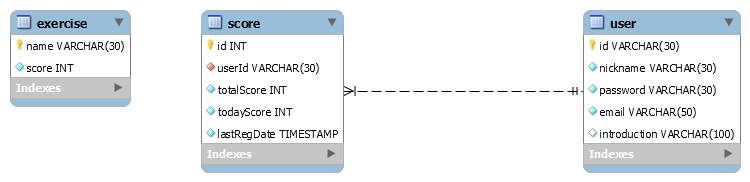
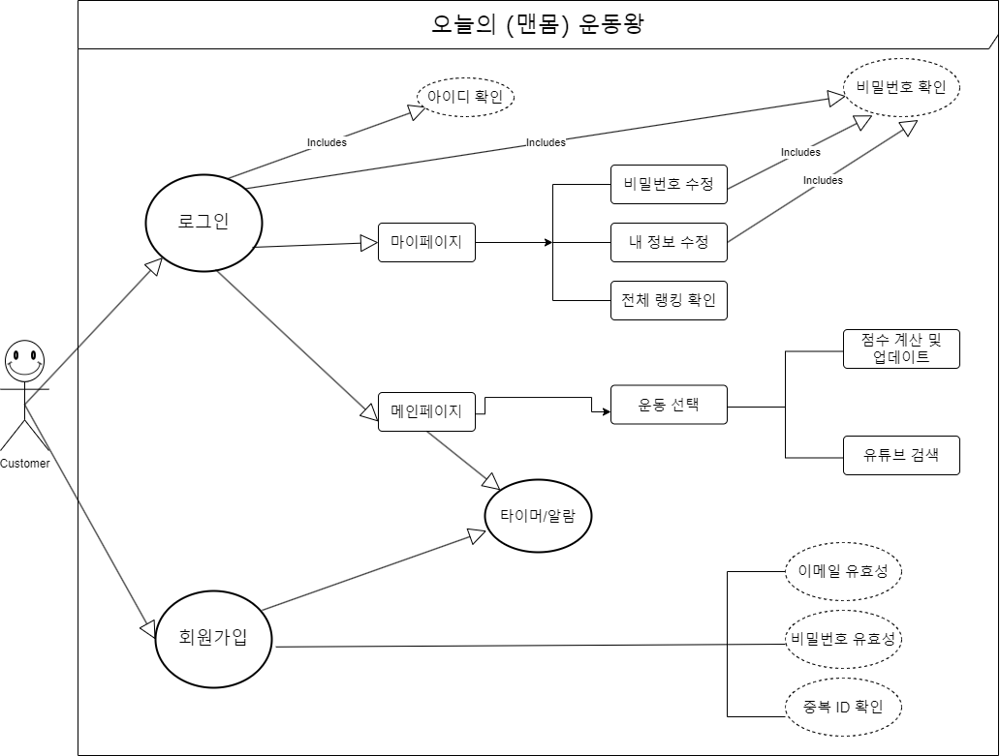
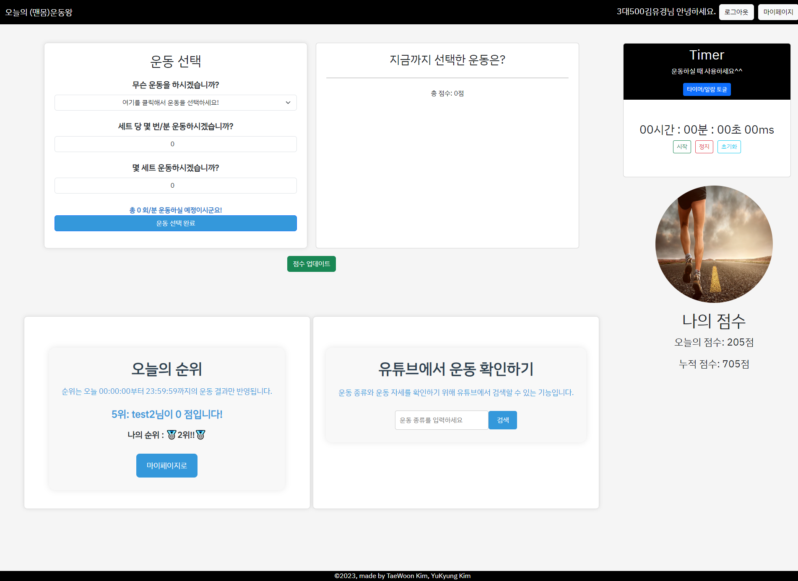
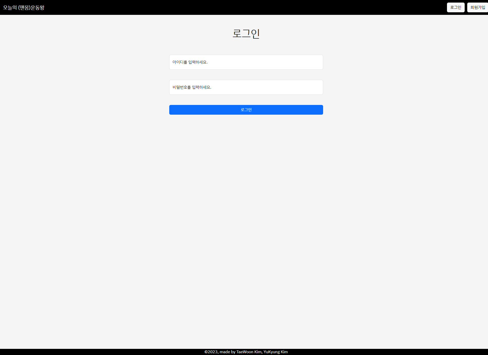
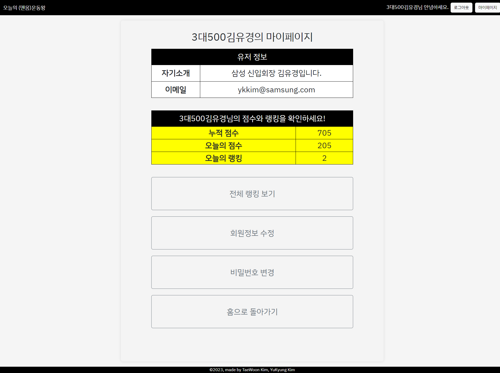
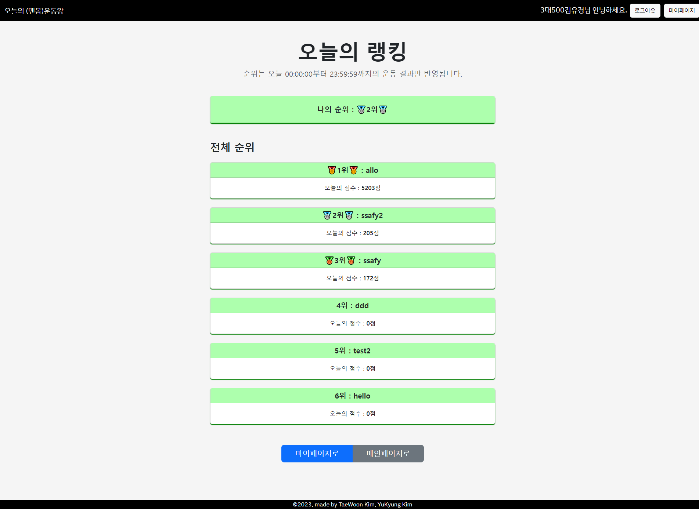
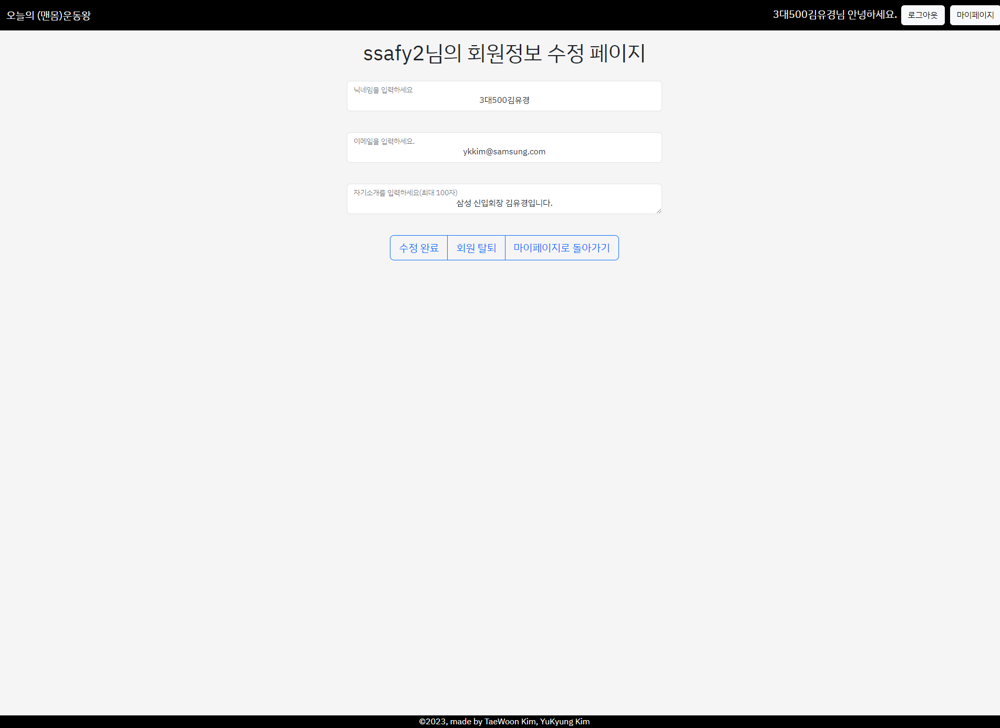
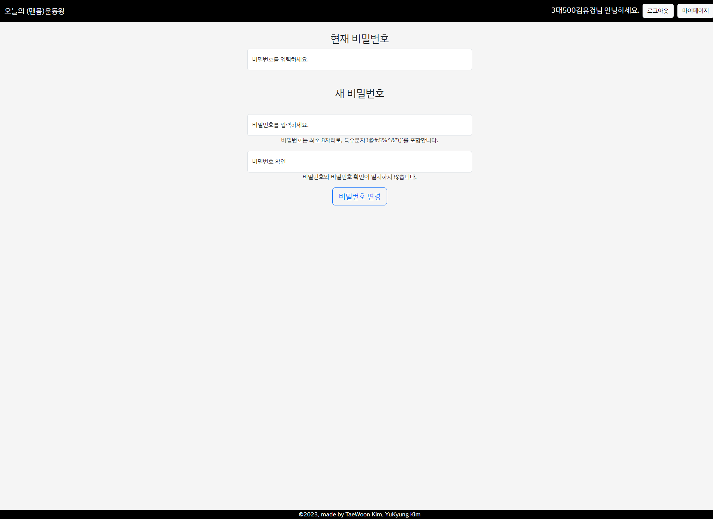
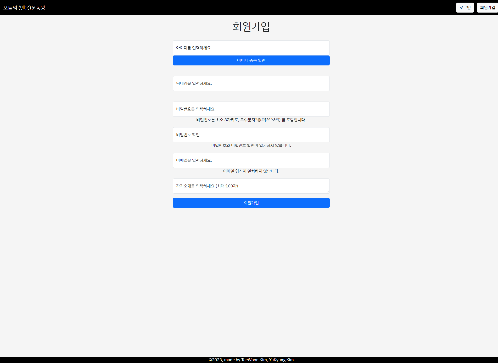

# 🧑‍🎓 FINAL PROJECT 오늘의 (맨몸)운동왕

## 1학기 최종 프로젝트
이 웹 애플리케이션은 사용자가 운동을 기록하고, 그에 따른 점수를 관리하고 랭킹을 확인할 수 있는 기능을 제공합니다.
 

## 🤜 팀원 구성 🤛

<table align="center">
    <tr align="center">
        <td style="min-width: 130px;">
            <a href="https://github.com/twnkm7089">
              
               
              <b>김태운</b>
            </a>
        </td>
        <td style="min-width: 130px;">
            <a href="https://github.com/YUKYUNGkKIM">
              
               
              <b>김유경</b>
            </a>
        </td>
    </tr>
</table>

## 📃 개요
- 지금까지 배운 기술을 토대로 운동과 관련된 웹 사이트를 만들어 보았습니다.
- 만성 운동 부족에 시달리나 시간은 부족한 사람들이 많은 상황에 맞추어 맨몸 운동에 관한 To-do list 사이트를 구현하는 아이디어를 구상했고, 이를 구현해 보았습니다.

### ✔ 프로젝트 요구 사항
- 맨몸 운동에 대한 To-do list 구현 및 업데이트를 통해 DB에 점수 갱신되도록 하기.
- 유저 관련 CRUD를 통해 회원 가입, 탈퇴, 로그인, 로그아웃, 정보 수정 구현.
- 랭킹 기능 구현
- 운동을 보조하는데 사용 가능한 타이머, 알람, 유튜브 검색 기능 추가

### 😀 참여 인원, 사용 기술
- 참여 인원 : 김태운, 김유경
- 프로젝트 진행 기간 : 2023-11-16 ~ 2023-11-24
- 사용 프레임워크 : Vue.js, SpringBoot
- 사용 프로그래밍 언어 : Java, JavaScript, SQL
- 사용 DB : MySQL
- 그 외 사용 도구 : figma, notion, git, Visual Studio Code

---

## 🎨 페이지 디자인 예시
- figma 링크 : https://www.figma.com/file/iMSXIdEunshLHTqTAscRtD/1%ED%95%99%EA%B8%B0-%EC%B5%9C%EC%A2%85-pjt?type=design&node-id=0-1&mode=design&t=YwUuC8fGiWLsW4UA-0

---

## 📚 ERD

- 세 개의 테이블로 구성되어 있습니다.
  - score : 유저의 점수 정보가 저장되어 있습니다.
    - id(정보 구분용),  userId(유저의 id,user 테이블의 id를 외래키로 함), totalScore(유저의 누적 점수), todayScore(오늘의 점수), lastRegDate(마지막 등록 시간)가 저장되어 있습니다.
  - user : 유저의 정보가 저장되어 있습니다.
    - id(유저의 id), nickname(닉네임), password(비밀번호), email(이메일), introduction(자기소개)가 저장되어 있습니다.
  - exercise : 운동 이름과 운동에 대한 1회당(또는 1분당) 점수가 저장되어 있습니다.
    - name(운동 이름), score(운동의 단위 점수)

---

## 🛠 클래스 다이어그램

---
    
## 👨‍👨‍👦‍👦 유즈케이스 다이어그램

   
---

## 프로젝트 전체 구조
- 백엔드
 

- 프론트엔드   
 

 

---

## 📝 페이지별 상세 기능

---

### 🏠 메인 페이지

#### ❗ 로그인 전
.png)
- **로그인/회원가입 버튼**: 로그인 혹은 회원가입 페이지로 이동할 수 있는 버튼이 있습니다.
- **오늘의 순위 기능**: 오늘의 순위가 1.5초마다 자동으로 업데이트되어 보여집니다. 하지만, 사용자의 순위는 로그인을 해야만 볼 수 있습니다.
- **타이머 기능**: 운동을 할 때 사용할 수 있는 타이머 기능이 있습니다. '시작', '정지', '초기화' 기능을 사용할 수 있습니다.
- **알람 기능**: 운동을 할 때 사용할 수 있는 알람 기능이 있습니다. '시작', '정지', '초기화' 기능을 사용할 수 있습니다. 10초, 1분 단위로 시간 설정이 가능하고 타이머가 완료되면 알림 창이 뜹니다.
- **유튜브 검색 기능**: 운동을 할 때 필요한 유튜브 영상을 찾아볼 수 있습니다. 검색 시 최대 3개의 영상이 모달 창에 뜹니다.
- **나의 점수 확인 기능**: 사용자는 로그인을 해야만 '오늘의 점수'와 '누적 점수'를 확인할 수 있습니다.

#### ✔️ 로그인 후

- **운동 선택 기능**: 사용자는 원하는 운동 종류를 선택하고, 세트 당 반복 횟수와 세트 횟수를 입력할 수 있습니다.
- **운동 기록 확인 기능**: 사용자가 지금까지 선택한 운동들을 확인할 수 있으며, 각 운동을 완료했을 때 받을 수 있는 점수를 보여줍니다.
- **운동 완료 체크 기능**: To-do List 형식으로 운동 완료 여부를 체크하고 관리할 수 있습니다. 또한, 삭제 버튼을 통해 운동 기록을 삭제할 수 있습니다.
- **점수 업데이트 기능**: '점수 업데이트' 버튼을 누르면, 오늘의 점수와 누적 점수가 업데이트되어 회원정보에 반영됩니다. 또한, 이 업데이트는 사용자의 랭킹에도 반영됩니다.
- **오늘의 순위 기능**: 오늘의 순위가 1.5초마다 자동으로 업데이트되어 보여집니다. 사용자의 순위는 그 밑에 고정되어 표시됩니다.
- **타이머 기능**: 운동을 할 때 사용할 수 있는 타이머 기능이 있습니다. '시작', '정지', '초기화' 기능을 사용할 수 있습니다.
- **알람 기능**: 운동을 할 때 사용할 수 있는 알람 기능이 있습니다. '시작', '정지', '초기화' 기능을 사용할 수 있습니다. 10초, 1분 단위로 시간 설정이 가능하고 타이머가 완료되면 알림 창이 뜹니다.
- **유튜브 검색 기능**: 운동을 할 때 필요한 유튜브 영상을 찾아볼 수 있습니다. 검색 시 최대 3개의 영상이 모달 창에 뜹니다.
- **나의 점수 확인 기능**: 사용자는 '오늘의 점수'와 '누적 점수'를 확인할 수 있습니다.

---

### 🔑 로그인 페이지

- **로그인 기능**: 사용자는 아이디와 비밀번호를 입력하여 로그인할 수 있습니다.

---

### 🖼️ 마이페이지(회원정보)

- **유저 정보 확인 기능**: 사용자는 회원가입 때 기입했던 자기소개와 이메일을 확인할 수 있습니다.
- **점수 및 랭킹 확인 기능**: 사용자는 자신의 누적 점수, 오늘의 점수, 그리고 오늘의 랭킹을 확인할 수 있습니다.
- **페이지 이동 기능**: '전체 랭킹 보기', '회원 정보 수정', '비밀번호 변경', '홈으로 돌아가기' 버튼을 통해 각각의 페이지로 이동할 수 있습니다.

---

### 🏆 랭킹페이지

- **나의 순위 확인 기능**: 사용자는 자신의 순위를 확인할 수 있습니다. 1, 2, 3등일 때는 특별한 이모티콘으로 기념을 표시해줍니다.
- **전체 순위 확인 기능**: 사용자는 전체 순위와 각 사용자의 점수를 확인할 수 있습니다.

---

### ✏️ 회원정보 수정 페이지

- **정보 수정 기능**: 사용자는 닉네임과 이메일('@'포함 필수), 그리고 자기소개(최대 100자)를 수정할 수 있습니다. 수정이 완료되면 '수정 완료' 버튼을 클릭하여 변경 사항을 저장할 수 있습니다. 정보 수정 후에는 재로그인이 필요합니다.
- **회원 탈퇴 기능**: '회원 탈퇴' 버튼을 통해 회원 탈퇴를 진행할 수 있습니다.

---

### 🔄 비밀번호 변경 페이지

- **비밀번호 변경 기능**: 사용자는 현재 비밀번호를 입력한 후, 새로운 비밀번호(최소 8자리, 특수문자 포함)로 변경할 수 있습니다. 비밀번호 변경이 완료되면 '비밀번호 변경' 버튼을 클릭하여 변경 사항을 저장합니다. 비밀번호 변경 후에는 재로그인이 필요합니다.

---

### 📝 회원가입 페이지

- **아이디 중복 확인 기능**: '아이디 중복 확인' 버튼을 통해 입력받은 아이디가 기존 회원과 겹치는지 확인할 수 있습니다.
- **회원가입 기능**: 사용자는 아이디, 닉네임, 비밀번호(최소 8자리, 특수문자 포함), 비밀번호 확인, 이메일('@'포함 필수), 그리고 자기소개(최대 100자)를 입력하여 회원가입을 진행할 수 있습니다.
- **회원가입 완료 기능**: '회원가입' 버튼을 클릭하여 회원가입을 완료하고 메인 페이지로 돌아갈 수 있습니다.

---

