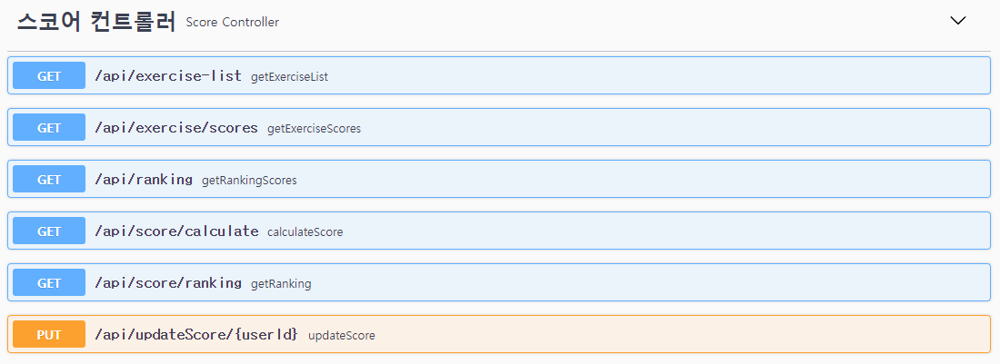
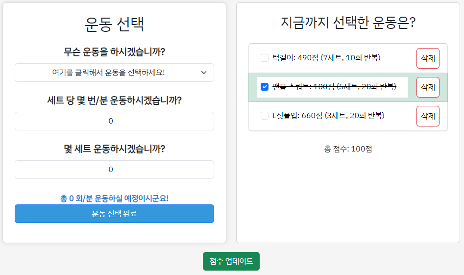
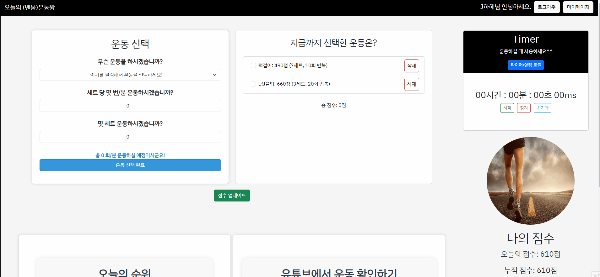

# 🏹SSAFY 1학기 최종 관통 프로젝트 (오늘의 (맨몸)운동왕)🏃‍♂️

### A. 맡은 역할
1. **기획**: 문제 기획, 정의 (공통)
2. **BackEnd**: 스코어 REST_API
3. **FrontEnd**: To-do 리스트 제작 및 데이터 불러오기, 점수 계산 후 반영
4. **FrontEnd**: 관련 CSS 정리

<br>

### B. 구체적인 이야기
#### 1. 기획 (11월 16일 ~ 11월 17일)
- 팀장 태운님과 팀원인 저 둘 다 운동에 크게 흥미가 있었던 편이 아니고, 아는 것도 많지 않아서 주제가 '운동'이라고 했을 때 고민이 많이 되었습니다.
- 아이디어톤 하던 것 같이 아무 주제나 던져보고 나왔던 것 중에 가장 좋았던 이 '오늘의 (맨몸)운동왕'을 선정해서 사용해보고자 했습니다.
- 이 큰 틀은 제가 낸 아이디어였지만, 구체적으로 어떤 기능을 사용할지에 대해서, 그리고 디테일 같은 것들은 태운님이 많이 아이디어를 내주셔서 완벽히 같이 만든 아이디어라 말할 수 있을 것 같습니다.

<br>

#### 2. BackEnd - 스코어 REST_API (11월 16일 ~ 11월 19일)

- 처음부터 같은 팀원과 주제를 잡고, 어떠한 api가 필요할지에 대해 고민하는 것이 익숙하지 않아서 이것저것 수정하느라 REST_API 구성에 시간을 많이 쏟았습니다.
- 더 정말 솔직하게 말하자면, 타 프로젝트를 진행할 때에도 컨트롤러 구성을 제가 해보지 않아서 더 고민이 많았습니다. 수업 때 사용했던 예제코드들을 많이 돌려보기도 하고, 인터넷 검색 등을 통해 궁금한 것들을 해결하면서 구성했습니다.
- 직접 해보면서 GET을 쓰고, PUT, POST, DELETE 등을 어디에 왜 사용하는지에 대해 알 수 있었습니다.
  <br>

```
@RestController
@RequestMapping("/api")
@Api(tags="스코어 컨트롤러")
public class ScoreController {
    
@Autowired
private ScoreService scoreService;

@GetMapping("/exercise/scores")
@ApiOperation(value="getExerciseScores", notes="운동별 점수 가져오기")
public ResponseEntity<Map<String, Integer>> getExerciseScores() {
    Map<String, Integer> exerciseScores = scoreService.getExerciseScores();
    return new ResponseEntity<>(exerciseScores, HttpStatus.OK);
}

@GetMapping("/ranking")
@ApiOperation(value="getRankingScores", notes="랭킹 정보 가져오는 부분")
public ResponseEntity<List<Map<String, Object>>> getRankingScores() {
    List<Map<String, Object>> ranking = scoreService.getRankingScores();
    return new ResponseEntity<>(ranking, HttpStatus.OK);
}
    
@GetMapping("/score/ranking")
@ApiOperation(value="getRanking", notes="유저들의 점수 받아와서 등수대로 정렬하는 부분")
public ResponseEntity<List<Score>> getRanking() {
    List<Score> ranking = scoreService.getRanking();
    return new ResponseEntity<>(ranking, HttpStatus.OK);
}
    
@GetMapping("/exercise-list")
@ApiOperation(value="getExerciseList", notes="운동정보 가져오는 부분")
public ResponseEntity<List<String>> getExerciseList() {
    List<String> exerciseList = scoreService.getExerciseList();
    System.out.println("Exercise List from Backend: " + exerciseList);
    return new ResponseEntity<>(exerciseList, HttpStatus.OK);
}
    
//점수 수정
@PutMapping("/updateScore/{userId}")
@ApiOperation(value="updateScore", notes="점수 업데이트해주기 위한 부분")
public ResponseEntity<Void> updateScore(@RequestBody Score score, @PathVariable String userId){
  	System.out.println(score);
  	score.setUserId(userId);
  	scoreService.updateScore(score);
  	return new ResponseEntity<Void>(HttpStatus.OK);
}
```
<br>

- REST_API보다 더 애먹은 부분이 어디가 있을까 하고 고민해보면 생각나는 것은 DB, FRONT와의 연결이었습니다. 어떠한 코드가 연결을 돕는지 머릿속에서 구현이 안되어서 많이 고민했던 시기가 있었던 것 같습니다.
- SQL에 대해서는 공부했었기 때문에 mapper구성은 어렵지 않았습니다.
```
<?xml version="1.0" encoding="UTF-8" ?>
<!DOCTYPE mapper
  PUBLIC "-//mybatis.org//DTD Mapper 3.0//EN"
  "https://mybatis.org/dtd/mybatis-3-mapper.dtd">
<mapper namespace="com.exercise.pjt.model.dao.ScoreDao">


<select id="selectScore" resultType="Score" parameterType="String">
    SELECT *
    FROM Score
    WHERE userId = #{userId}
</select>
    
<insert id="saveScore" parameterType="Score">
    INSERT INTO Score (userId, totalScore, todayScore, lastRegDate)
    VALUES (#{userId}, #{totalScore}, #{todayScore}, #{lastRegDate})
</insert>
    
<delete id="deleteScore" parameterType="String">
    DELETE FROM Score
    WHERE userId = #{userId}
</delete>
    
    
<!-- 전체 랭킹 출력, 오늘 운동한 사람만 나오게 지정 -->
<select id="selectRanking" resultType="Score">
    SELECT *
    FROM Score
    WHERE DATE_FORMAT(lastRegDate, "%Y-%m-%d") = CURDATE()
    ORDER BY todayScore DESC
</select>
    
<select id="selectAllScores" resultType="Score">
    SELECT *
    FROM Score
</select>
    
    
<select id="getExerciseScores" resultType="com.exercise.pjt.model.dto.ExerciseScore">
    SELECT *
    FROM Exercise
    ORDER BY score;
</select>
    
<!-- 운동 목록 조회 -->
<select id="getExerciseList" resultType="String">
	SELECT * FROM Exercise ORDER BY score;
	</select>
	
<!-- 점수 update -->
<update id="updateScore" parameterType="Score">
	UPDATE Score
	SET totalScore = totalScore + #{totalScore}, todayScore = todayScore + #{todayScore}, lastRegDate = now()
		WHERE userId = #{userId}
</update>
</mapper>
```
<br>

#### 2. FrontEnd: To-do 리스트 제작 및 점수 계산 후 반영 (11월 18일 ~ 11월 22일)


##### (1) to-do 리스트 제작
- 투두리스트 제작! 저의 프론트엔드 구현에서 가장 책임감을 가지고 임했던 작업 중 하나입니다.
- 운동종류를 DB -> BackEnd -> Front로 가져오는 작업에 공을 많이 들였습니다. upperCase, lowerCase 하나로 많이 갈리기 때문에 신경을 많이 쓰고, 오류가 많이 나서 걱정하기도 했습니다.
- REST_API의 구성을 잘 해둬야 데이터를 가져올 수 있다는 것을 다시 한 번 느낄 수 있었습니다.
- input으로 숫자 값을 가져올 수 있어서 이것은 발전이라고 생각했습니다! 

<br>

##### (2) 점수 계산
- BackEnd에서 데이터를 넘겨줄 때, DB에 저장되어있는 운동종류와 점수를 모두 연계해서 넘겨주는 것이 어려웠습니다. 그것만 가져오면 점수 계산은 쉬울 것이라 생각했습니다.
- 역시 여기에서도 API의 구성이 중요하다는 것을 알게 되었고, SPRING에서도 적절한 MAP을 사용해서 동시에 넘겨주는 것에 대한 고민을 많이 했습니다.
```
@GetMapping("/exercise/scores")
@ApiOperation(value="getExerciseScores", notes="운동별 점수 가져오기")
public ResponseEntity<Map<String, Integer>> getExerciseScores() {
    Map<String, Integer> exerciseScores = scoreService.getExerciseScores();
    return new ResponseEntity<>(exerciseScores, HttpStatus.OK);
}
```
이 부분이었습니다. 운동별 점수 가져오는 것이 어려웠습니다! 하지만 해냈습니다!!

<br>

##### (3) 점수 반영 (11월 21일)
- 여기까지 구현했다 하더라도 사실 DB에 다시 보내지 못하면 의미가 없었습니다. DB에 옮겨서 랭킹을 구현하는 것까지가 저희의 목표였기 때문에 어깨가 더 무거워졌던 것 같습니다!.
- 제가 못하면 태운님에게 SOS를 보내고 함께 구현해야하나 라는 걱정까지 했는데 다행히 수업시간에 했던 내용으로 구현해볼 수 있었습니다.
<br>



```
//점수 수정
@PutMapping("/updateScore/{userId}")
@ApiOperation(value="updateScore", notes="점수 업데이트해주기 위한 부분")
public ResponseEntity<Void> updateScore(@RequestBody Score score, @PathVariable String userId){
  	System.out.println(score);
  	score.setUserId(userId);
  	scoreService.updateScore(score);
  	return new ResponseEntity<Void>(HttpStatus.OK);
}
```
<br>

#### 4. CSS (11월 21일 ~ 11월 23일)
- 공을 많이 들이게 될 줄 몰랐는데, 의외로 시간을 가장 많이 할애했던 것이 CSS였습니다.
- 교수님께서 처음부터 '주말까지 구현을 끝내고 마지막 주간에는 CSS 많이 해야 할 것이다', 혹은 '프로젝트에서 백엔드 1명, 프론트엔드 2명이 이상적이다.' 라고 하셨을 때 그 이유에 대해 잘 몰랐던 부분이 있었던 것 같습니다.
- 해보니 알 수 있었습니다. 제 생각대로 움직이지 않는 부분이 정말 많았고, 시간이 많이 필요하다는 것을 느꼈습니다.
- 어떻게 만들어도 예쁘지 않다는 생각도 들어서, '미적감각이 정말 많이 필요한 분야구나' 라는 생각과, '기존 웹사이트 개발자분들은 정말 대단하구나'라는 생각도 했습니다.
- 전반적으로 디자인을 확인하면서 수정하는 작업을 통해 어떻게 하면 사용자에게 더 친화적인 페이지를 만들 수 있을까 고민했던 시간이 되었습니다.
  

<br>

### C. 전체 회고
- 일단, 이렇게 오랜 시간 누군가와 둘이서 함께 프로젝트를 진행한 것은 거의 처음인 것 같아서, 새로운 경험이었습니다.
- 프로젝트를 진행하면서 부족했던 부분을 공부하면서 같이 진행하고 있다는 느낌이 들어, 역시 성장에는 직접 구현/실현해보는 것이 중요하구나 라는 것을 알 수 있었습니다.
- 하면 할수록 저의 부족한 점을 많이 알 수 있었던 것 같습니다. 시간이 있을 때 추가적인 공부와 구현을 통해 해당 프로젝트를 오늘에서 끝내지 않고, 더 나아가 성장할 수 있는 발판으로 만들고 싶습니다.
- 그리고 가장 중요한 사항은, 부족한 저와 함께 해주고, 저의 코드를 함께 봐주면서 오류와 디자인을 함께 수정해준 팀장, 태운님에게 감사하다는 말도 하고 싶습니다.
- 하나 덧붙이자면... 이상적이지는 않지만, 11/14, 11/17 취업 면접 일정과 파이널 프로젝트를 함께 했던 저에게도 수고했다는 말 함께 하고 싶습니다.
